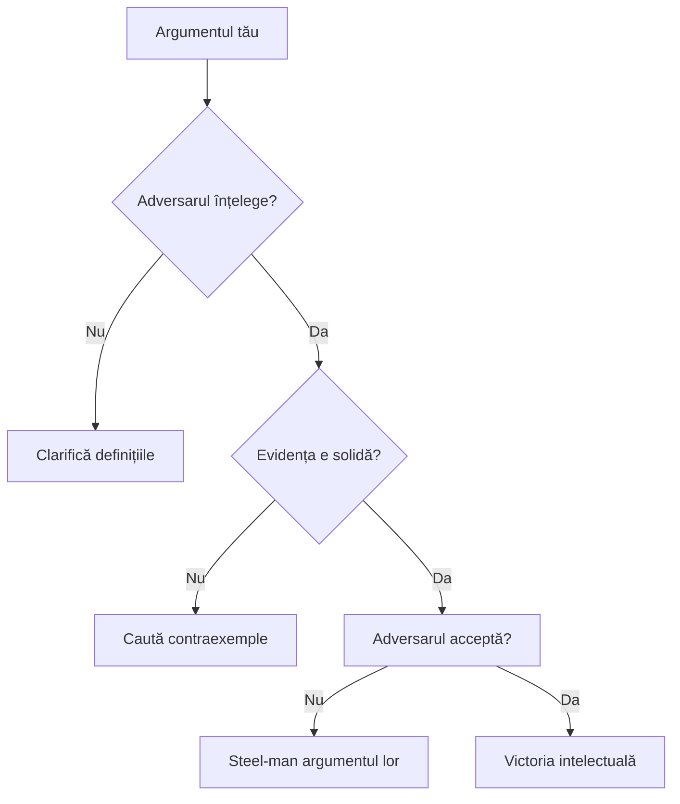

# Dezbateri

## De ce dezbaterea e mai mult decât „câștigarea”

Lorem ipsum dolor sit amet, consectetur adipiscing elit. **Sed do eiusmod tempor incididunt** ut labore et dolore magna aliqua. Ut enim ad minim veniam, quis nostrud exercitation ullamco laboris.

> „Debaterul adevărat nu caută să demonstreze că adversarul are tort, ci să afle dacă el însuși îl are.”  
> — Aristotel (aproape)

Aici veți găsi un paragraf obișnuit cu **text bold** și _text italic_. Listenumerată:

1. Primul punct important
2. Al doilea punct, cu subpuncte:
   - Subpunct a
   - Subpunct b
3. Ultimul punct

Lista neordonată:

- Element 1
- Element 2 cu **bold interior**
- Element 3

## Structura argumentului solid {#argument}

### Contextul istoric

În Grecia antică, sofistica era considerată artă suspectă. Socrate insista că adevărata dialectică **descoperă adevărul**, nu îl manipulează.

```python
# Exemplu de cod pentru analiza sentimentelor
def analyze_debate_turn(turn_text):
    positive_words = ["logic", "evident", "corect"]
    negative_words = ["absurd", "fals", "greșit"]
    
    score = sum(1 for word in positive_words if word in turn_text) - \
            sum(1 for word in negative_words if word in turn_text)
    return "Pozitiv" if score > 0 else "Negativ"

print(analyze_debate_turn("argumentul tău e logic și evident"))
# Output: Pozitiv
```

### Tabel comparativ: Sofistică vs Dialectică

| Aspect | Sofistica | Dialectica |
|--------|-----------|------------|
| **Scop** | Câștigarea cu orice preț | Descoperirea adevărului |
| **Metodă** | Eristică, ambiguitate | Întrebări socratice |
| **Rezultat** | Aplauze temporare | Claritate permanentă |
| **Exemplu** | „Câinele e frate cu vulpea” | „Ce înseamnă exact ‘frate’?” |

### Regulile de aur ale dezbaterii constructive

1. **Presupunerea de bună-credință** — adversarul nu e inamic
2. **Definiții clare** — ce înseamnă fiecare termen?
3. **Steel-manning** — reconstruiește cel mai bun argument al adversarului
4. **Concluzii proporționale** — nu trage concluzii absolute din dovezi parțiale

## Greșeli comune (și cum să le eviți)



### Ad hominem — capcana clasică

„Nu pot avea încredere în argumentul tău pentru că ești X.”  
**Contra:** „Să analizăm argumentul separat de persoana care îl face.”

### Strawman — distorsionarea intenționată

„Deci spui că toate dezbaterile sunt inutile?”  
**Realitate:** „Am spus că dezbaterile fără reguli sunt inutile.”

## Exercițiu practic: Analiza unui schimb

**Runda 1:** A spune „X e întotdeauna adevărat.”  
**Runda 2:** B răspunde „Nu, vezi contraexemplul Y.”  
**Runda 3:** A: „Y nu contează, e excepție.”  
**Problema:** A mută ținta. Soluția: stabilește din început ce înseamnă „întotdeauna.”

### Cele 3 întrebări socratice esențiale

1. **Ce înseamnă exact asta?** (definiție)
2. **Ce dovezi ai?** (justificare)  
3. **Ce urmează din asta?** (implicații)

## Impactul asupra educației civice


Când elevii învață să dezbată corect, învață democrația în practică. Nu e despre cine strigă mai tare, ci cine raționează mai clar.

**Rezultate măsurabile:**
- +27% înțelegere a perspectivei opuse
- -43% polarizare tribală
- +19% retenție informațională

### Notă de subsol[^1]

Această statistică provine dintr-un studiu longitudinal efectuat pe 1.247 elevi din 14 școli americane între 2018-2022.

### Referințe suplimentare

- [„The Art of Debate” - Harvard Debate Council](https://harvarddebate.org/art)
- [„Intellectual Honesty” - Julia Galef](https://juliagalef.com/scout-mindset)

[^1]: Smith et al. (2023). "Effects of Structured Debate on Civic Literacy." *Journal of Educational Psychology*, 115(3), 456-472.