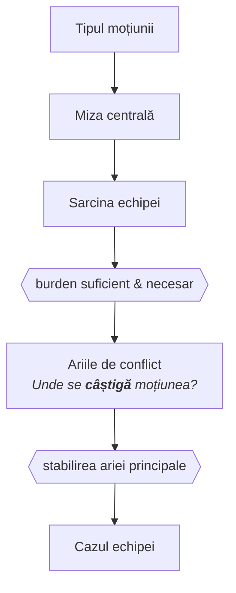

# Disecarea moțiunii și burden mapping

## De ce analiza moțiunii vine înaintea oricărui argument

Există un reflex comun în pregătire: auzi moțiunea, îți vin imediat în minte argumente, și începi să le dezvolți. Acesta este cel mai scump obicei pe care îl poți avea în impromptu.

Argumentele generate fără o analiză prealabilă a moțiunii sunt aproape întotdeauna argumente despre _subiect_, nu argumente care câștigă _dezbaterea_. Diferența e crucială. O dezbatere despre legalizarea drogurilor nu e câștigată de echipa care știe mai multe despre droguri, ci de cea care înțelege mai bine ce _întrebare_ pune moțiunea concretă și ce trebuie dovedit pentru a răspunde la ea.

Analiza moțiunii este o disciplină de compresie: transformi o frază ambiguă într-un set precis de întrebări la care echipa ta trebuie să răspundă afirmativ, iar echipa adversă negativ. Tot ce urmează în prep și în discursuri derivă din această compresie.


Setul de condiții logice pe care o echipă trebuie să le satisfacă pentru a câștiga dezbaterea. Nu este lista de argumente, ci structura anterioară argumentelor, care specifică ce contează și de ce. Un caz fără burden explicit clar e un caz care poate fi câștigat pe orice criteriu ales arbitrar de judecător.



Tensiunea filozofică sau empirică fundamentală din care derivă toate argumentele relevante ale dezbaterii. Reprezintă întrebarea reală ascunsă sub subiect, iar identificarea corectă determină ce argumente contează și care sunt periferice, indiferent cât de bine sunt construite.



Punctul unde două poziții se întâlnesc direct, dintre care una trebuie să cedeze logic. Un argument necontrazis de adversari nu produce clash. Arbitrul acordă victoria echipei care câștigă clash-urile centrale, nu celei care a produs mai mult conținut neatacat.



Starea actuală a lucrurilor, pe care Guvernul o schimbă prin propunerea sa. Nu e neapărat apărată de Opoziție, deoarece poate propune o alternativă diferită de status quo și diferită de propunerea Guvernului.


## Sarcina echipelor în funcție de moțiune

## Identificarea mizei centrale

Odată ce știi tipul de moțiune și structura de burden implicată, urmează pasul cel mai important și cel mai dificil: să identifici întrebarea reală din spatele moțiunii.

Majoritatea moțiunilor au un subiect de suprafață și o miză profundă. Subiectul de suprafață e ceea ce crezi că e moțiunea la prima lectură. Miza profundă e tensiunea filozofică sau empirică fundamentală din care derivă toată dezbaterea.

Câteva exemple ilustrative:

O moțiune despre legalizarea prostituției e rar în mod real despre prostituție. Miza profundă e aproape întotdeauna o tensiune între autonomie (dreptul individului de a-și comercializa corpul) și protecție (dacă această autonomie e reală în contextele sociale concrete sau e o ficțiune legală care acoperă coerciție). Echipa care câștigă e cea care câștigă pe această tensiune, nu cea care știe mai multe statistici despre industria sexului.

O moțiune despre cotele de gen în corporații e despre meritocrație vs. corecție structurală a inegalității, sau mai precis, dacă meritocrația funcționează ca mecanism de selecție în absența corecțiilor, sau dacă e un ideal care nu se actualizează în condiții de inegalitate de pornire.

O moțiune despre pedeapsa capitală e cel mai adesea despre funcția penalității, retributivă vs. preventivă, și despre ce îi dă statului dreptul să ia o viață, nu despre statistici de recidivism.

**Tehnica de identificare a mizei centrale** se poate exersa sistematic astfel: după ce citești moțiunea, pune-ți întrebarea „De ce ar putea cineva _sincer_ să fie în dezacord cu poziția mea?". Răspunsul la această întrebare îți arată de obicei unde e tensiunea reală. Dacă nu poți formula un dezacord autentic față de propria poziție, fie nu ai înțeles moțiunea, fie ai o poziție care nu e de fapt contestată, ceea ce în World Schools e o problemă de definiție.

Un instrument util e și **reformularea moțiunii** ca întrebare deschisă: transformi „THW ban X" în „În ce condiții, dacă există, statul e justificat să restricționeze X, și sunt acele condiții prezente în contextul moțiunii?" Această reformulare forțează claritate pe burden și pe miza centrală simultan.

## Burden mapping

Burden mapping este procesul explicit de a răspunde la întrebarea: **ce trebuie dovedit pentru ca echipa mea să câștige dezbaterea?**

Nu e o listă de argumente. E o structură logică anterioară argumentelor, care specifică condițiile necesare și suficiente pentru victorie.

#### Burden necesar vs. burden suficient

Un burden necesar e ceva ce trebuie să dovedești pentru a nu pierde automat, dar dovedirea lui nu e suficientă pentru a câștiga. Un burden suficient e ceva ce, dacă e dovedit complet, câștigă dezbaterea independent de altceva.

Exemplu: Pe o moțiune prescriptivă de tipul „THW introduce compulsory voting," Guvernul are câteva burdens necesareȘ că democrația suferă de participare scăzută într-un mod semnificativ, că votul obligatoriu ar crește participarea calitativă (nu doar numerică), și că constrângerea e justificabilă în acest context. Niciun burden singular nu e suficient de unul singur; împreună, dacă sunt dovedite, câștigă. Dacă Opoziția aruncă unul (de exemplu, că votul forțat produce vot neinformat) Guvernul trebuie să îl răspundă direct, nu să adauge mai multe argumente pe celelalte.

#### Burden asimetric structural

World Schools are o asimetrie de burden structurală pe care mulți debaters nu o conștientizează explicit: **Guvernul schimbă status quo-ul, Opoziția îl apără.** Asta înseamnă că, în absența unor argumente de egală greutate, arbitrul nu se mișcă, adică Opoziția câștigă prin inerție.

Consecința practică: Guvernul trebuie să câștige net pozitiv, nu la egalitate. Opoziția poate câștiga demonstrând că argumentele Guvernului nu sunt suficient de puternice pentru a justifica schimbarea, chiar dacă nu respinge fiecare argument în parte.

Aceasta e o greșeală frecventă la nivel mediu: o echipă de Opoziție care crede că trebuie să dovedească că politica e proastă pierde energie, când uneori e mai eficient să demonstreze că nu e _suficient de bună_ pentru a justifica costurile sau riscurile schimbării.

#### Burden pe care NU trebuie să îl acoperi

La fel de important ca identificarea burden-ului real e identificarea burden-ului _ireal_: lucrurile care par că trebuie dovedite, dar nu trebuie.

Pe o moțiune despre pedeapsa capitală, Guvernul (care o susține) nu trebuie să dovedească că niciun nevinovat nu va fi executat vreodată (asta e un standard imposibil pe care Opoziția îl poate seta strategic, dar nu e standard real). Trebuie să dovedească că sistemul cu pedepsa capitală produce rezultate mai bune la nivelul societății decât alternativele, la nivelul de eroare inevitabil oricărui sistem judiciar.

Recunoașterea și _refuzul explicit_ al burden-urilor false este o tehnică avansată care schimbă cadrul dezbaterii. Se face în discurs direct: „Opoziția ne cere să dovedim X. Nu X e întrebarea relevantă. Întrebarea relevantă e Y, și iată de ce."

## Ariile de clash

Clash-ul e punctul unde două poziții se întâlnesc direct și una trebuie să cedeze. Nu toate argumentele produc clash, unele echipe vorbesc în paralel timp de 45 de minute fără să se contrazică de fapt, ceea ce e una dintre cele mai frecvente și mai costisitoare erori în World Schools.

#### Cum identifici ariile de clash în prep

Înainte de dezbatere, poți mapa clash-urile probabile cu o tehnică simplă: după ce ți-ai construit cazul, construiește mental cazul advers cel mai puternic posibil. Întrebarea nu e „ce ar putea spune adversarii?", e „ce ar spune adversarii cei mai buni din lume pe moțiunea asta?" Punctele unde cazul tău și cazul lor maximal se intersectează sunt ariile de clash.

Acestea sunt locurile unde dezbaterea se câștigă sau se pierde. Un arbitru bun acordă victoria echipei care câștigă clash-urile centrale, nu echipei care a produs mai multe minute de argumente necontrazise.

#### Ierarhizarea clash-urilor

Nu toate clash-urile au aceeași greutate în economia dezbaterii. Există clash-uri pe principii fundamentale (ex. autonomie vs. paternalism) și clash-uri pe mecanisme concrete (ex. dacă o politică specifică funcționează empiric). Un clash câștigat pe principiu tinde să fie mai greu decât unul câștigat pe mecanism, pentru că principiul afectează toate mecanismele.

Strategia corectă e să identifici **clash-ul central**, tensiunea fundamentală din care derivă toate celelalte și să îți investești resursele argumentative acolo, nu distribuit uniform pe toate punctele.

#### Clash-ul fantomă și cum îl eviți

Clash-ul fantomă apare când ambele echipe vorbesc despre același subiect, dar răspund la întrebări diferite. E deosebit de frecvent pe moțiuni cu termeni ambigui: Guvernul definește „democrație" ca procedură electorală, Opoziția o definește ca reprezentare autentică a voinței populare, și timp de 45 de minute ambele echipe au dreptate față de propria definiție, fără să se intersecteze de fapt.

Remediul e simplu la nivel de principiu și dificil la nivel de execuție: forțează clash-ul explicit. Când observi că adversarii operează cu o definiție sau un cadru diferit, nu ignora divergențal, adres-o direct. „Adversarii noștri argumentează că X, dar aceasta presupune că Y. Noi respingem presupunerea Y din următorul motiv..."

Fără această adresare explicită, arbitrul e pus în postura de a decide care definiție e mai bună fără să fi văzut argumentarea pentru asta, ceea ce e arbitrar.

## Compresia analitică în impromptu

Toate cele de mai sus sunt inutile dacă nu pot fi executate rapid sub presiune. Impromptul nu permite analiză largă și adâncă, încurajând o secvență clară de operații care să producă maxim de claritate analitică în timp minim.

**Prima operație (primele 5 minute): tipul moțiunii și burden-ul brut.** Citește moțiunea de mai multe ori. Identifică tipul (prescriptiv, evaluativ, comparativ, de actor). Formulează în una-două propoziții ce trebuie să dovedești pentru a câștiga. Nu argumenta încă, doar stabilește ce dezbatere ești în.

**Operația a doua (minutele 5-15): miza centrală și ariile de clash.** Pune întrebarea: „Care e tensiunea reală din spatele acestei moțiuni?" Generează rapid cazul advers cel mai puternic posibil și identifică unde se ciocnesc. Acestea sunt ariile de clash pe care echipa ta trebuie să le câștige.

**Operația a treia (minutele 15-35): construcția cazului în jurul clash-urilor.** Acum generezi argumente, dar nu argumente despre subiect în general, ci argumente care câștigă clash-urile identificate. Fiecare argument trebuie să răspundă la întrebarea: „Cum ajută asta echipa mea să câștige tensiunea centrală?"

**Operația a patra (minutele 35-50): testul de burden.** Revino la burden-ul formulat la prima operație. Cazul tău, dacă e dovedit integral, satisface burden-ul? Există burden-uri necesare neacoperite? Există argumente în cazul tău care nu contribuie la burden, adică sunt interesante dar irelevante? Elimină-le sau redistribuie resursele.

**Ultimele 10 minute: distribuție și coerență internă.** Echipa trebuie să știe cine acoperă ce, și argumentele trebuie să fie consistente intern. Două argumente contradictorii în cazul tău sunt mai rele decât un singur argument bun.

## Greșeli comune de evitat

**Confundarea burden-ului cu lista de argumente.** Burden-ul e structura logică care explică de ce argumentele contează. Fără burden explicit, argumentele sunt fapte flotante fără direcție.

**Ignorarea tipului de moțiune sub presiune.** În imprompt, sub stres, debaterii revin la instinct și tratează orice moțiune ca prescriptivă. O moțiune evaluativă tratată ca prescriptivă produce un caz care dovedește lucruri irelevante cu multă energie.

**Optimizarea pentru argumente tari, nu pentru clash-uri câștigate.** Un argument excelent pe o direcție pe care adversarii nu o atacă e timp irosit. Un argument mediu care câștigă clash-ul central valorează mai mult.

**Acceptarea implicită a burden-urilor false.** Dacă adversarii setează un standard imposibil și tu începi să îl adresezi în loc să îl refuzi, ai pierdut cadrul.

**Definițiile lăsate implicite.** Termenii-cheie din moțiune trebuie definiți explicit și defensibil înainte de a construi orice argument pe ei. O definiție atacabilă slăbește tot cazul construit pe ea.