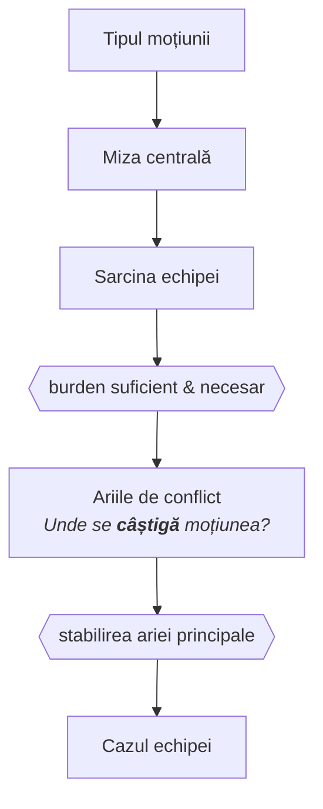

# Disecarea moțiunii și burden mapping

Există un reflex comun în pregătire: auzi moțiunea, îți vin imediat în minte argumente, și începi să le dezvolți. Acesta este cel mai scump obicei pe care îl poți avea.

Argumentele generate fără o analiză prealabilă a moțiunii sunt aproape întotdeauna argumente despre *subiect*, nu argumente care câștigă *dezbaterea*. Diferența e crucială. 

O dezbatere despre legalizarea drogurilor nu e câștigată de echipa care știe mai multe despre droguri, ci de cea care înțelege mai bine ce *întrebare* pune moțiunea concretă și ce trebuie dovedit pentru a răspunde la ea.

Analiza moțiunii este o disciplină de compresie: transformi o frază ambiguă într-un set precis de întrebări la care echipa ta trebuie să răspundă afirmativ, iar echipa adversă negativ. Tot ce urmează în prep și în discursuri derivă din această compresie.

## Miza centrală


Tensiunea filozofică sau empirică fundamentală din care derivă toate argumentele relevante ale dezbaterii. Reprezintă întrebarea reală ascunsă sub subiect, iar identificarea corectă determină ce argumente contează și care sunt periferice, indiferent cât de bine sunt construite.


### Subiect de suprafață vs. miză profundă

Majoritatea moțiunilor au un subiect de suprafață și o miză profundă. Subiectul de suprafață e ceea ce crezi că e moțiunea la prima lectură. Miza profundă e tensiunea filozofică sau empirică fundamentală din care derivă toată dezbaterea.

**Exemple ilustrative:**

| Moțiune (AP) | Subiect de suprafață | Miza profundă |
|--------------|---------------------|---------------|
| **AP ar legaliza prostituția** | Prostituția | Autonomie individuală vs. protecție împotriva coerciției structurale |
| **AP ar introduce cote de gen în corporații** | Cotele de gen | Meritocrație vs. corecție structurală a inegalității de pornire |
| **AP ar susține pedeapsa capitală** | Pedeapsa capitală | Funcția penalității (retributivă vs. preventivă) și legitimitatea statului de a lua o viață |
| **AP ar interzice discursul urii** | Libertatea de exprimare | Tensiunea dintre libertatea individuală și protecția grupurilor vulnerabile |

### Tehnica de identificare a mizei centrale

După ce citești moțiunea, pune-ți întrebarea:

> De ce ar putea cineva *sincer* să fie în dezacord cu poziția mea?

Răspunsul la această întrebare îți arată de obicei unde e tensiunea reală. Dacă nu poți formula un dezacord autentic față de propria poziție, fie nu ai înțeles moțiunea, fie ai o poziție care nu e de fapt contestată – ceea ce în World Schools e o problemă de definiție.

**Instrument util:** Reformulează moțiunea ca întrebare deschisă. Transformi *„AP ar interzice X"* în:

> „În ce condiții, dacă există, statul e justificat să restricționeze X, și sunt acele condiții prezente în contextul moțiunii?"

Această reformulare forțează claritate pe burden și pe miza centrală simultan.

**Operația în prep:** Minutele 5–15 sunt pentru identificarea mizei centrale și generarea cazului advers maximal. Întrebarea nu e „ce ar putea spune adversarii?", ci „ce ar spune adversarii cei mai buni din lume pe moțiunea asta?"

## Sarcina echipei (Burden)


Setul de condiții logice pe care o echipă trebuie să le satisfacă pentru a câștiga dezbaterea. Nu este lista de argumente, ci structura anterioară argumentelor, care specifică ce contează și de ce. Un caz fără burden explicit clar e un caz care poate fi câștigat pe orice criteriu ales arbitrar de judecător.


### Burden necesar vs. burden suficient

| Tip | Definiție | Exemplu pe *AP ar introduce compulsory voting* |
|-----|-----------|----------------------------------------------|
| **Necesar** | Ce trebuie să dovedești pentru a *nu pierde automat*, dar dovedirea lui nu e suficientă pentru victorie | Că democrația suferă de participare scăzută într-un mod semnificativ |
| **Suficient** | Ce, dacă e dovedit complet, câștigă dezbaterea independent de altceva | Că votul obligatoriu produce o democrație *calitativ mai bună* (nu doar numeric), iar constrângerea e justificabilă |

Pe o moțiune prescriptivă, Guvernul are de obicei 3-4 burdens necesare care, *împreună*, devin suficiente. Dacă Opoziția aruncă unul (de exemplu, că votul forțat produce vot neinformat), Guvernul trebuie să îl răspundă direct, nu să adauge mai multe argumente pe celelalte.

### Asimetria structurală de burden în World Schools

World Schools are o asimetrie de burden structurală pe care mulți debaters nu o conștientizează explicit.

Un bun exemplu se întâmplă la moțiunile de implementare, unde opoziția poate decide să apare starea de fapt, chiar dacă nu este necesar. În absența unor argumente de egală greutate între guvern și opoziție, arbitrul nu se mișcă, adică opoziția câștigă prin inerție.

**Consecința practică:**
- **Guvernul** trebuie să câștige *net pozitiv*, nu la egalitate.
- **Opoziția** poate câștiga demonstrând că argumentele Guvernului nu sunt suficient de puternice pentru a justifica schimbarea, chiar dacă nu respinge fiecare argument în parte.

Aceasta e o greșeală frecventă la nivel mediu: o echipă de Opoziție care crede că trebuie să dovedească că politica e *proastă* pierde energie, când uneori e mai eficient să demonstreze că nu e *suficient de bună* pentru a justifica costurile sau riscurile schimbării.

### Burden pe care NU trebuie să îl acoperi

La fel de important ca identificarea burden-ului real e identificarea burden-ului *ireal*: lucrurile care par că trebuie dovedite, dar nu trebuie.

**Exemplu:** Pe o moțiune despre pedeapsa capitală, Guvernul (care o susține) *nu* trebuie să dovedească că niciun nevinovat nu va fi executat vreodată (asta e un standard imposibil pe care Opoziția îl poate seta strategic, dar nu e standard real). Trebuie să dovedească că sistemul cu pedepsa capitală produce rezultate mai bune la nivelul societății decât alternativele, la nivelul de eroare inevitabil oricărui sistem judiciar.

**Tehnică avansată:** Recunoașterea și *refuzul explicit* al burden-urilor false schimbă cadrul dezbaterii. Se face în discurs direct:

> *„Opoziția ne cere să dovedim X. Nu X e întrebarea relevantă. Întrebarea relevantă e Y, și iată de ce."*

**Operația în prep:** Ultimele 10 minute din prep includ testul de burden: *„Cazul meu, dacă e dovedit integral, satisface burden-ul? Există burden-uri necesare neacoperite? Există argumente interesante dar irelevante?"*

## Ariile de conflict (Clash)


Punctul unde două poziții se întâlnesc direct, dintre care una trebuie să cedeze logic. Un argument necontrazis de adversari nu produce clash. Arbitrul acordă victoria echipei care câștigă clash-urile centrale, nu celei care a produs mai mult conținut neatacat.


### Cum identifici ariile de clash în prep

Înainte de dezbatere, poți mapa clash-urile probabile cu o tehnică simplă:

1. Construiește-ți cazul.
2. Construiește mental cazul advers cel mai puternic posibil.
3. Punctele unde cazul tău și cazul lor maximal se intersectează sunt **ariile de clash**.

Acestea sunt locurile unde dezbaterea se câștigă sau se pierde. Un arbitru bun acordă victoria echipei care câștigă clash-urile centrale, nu echipei care a produs mai multe minute de argumente necontrazise.

### Ierarhizarea clash-urilor

Nu toate clash-urile au aceeași greutate în economia dezbaterii:

| Nivel | Tip de clash | Exemplu | Greutate strategică |
|-------|--------------|---------|---------------------|
| **Fundamental** | Pe principii (autonomie vs. paternalism) | *Are statul dreptul să intervină în deciziile corporale ale individului?* | Cel mai greu – afectează toate mecanismele |
| **Empiric** | Pe mecanisme concrete (funcționează politica?) | *Votul obligatoriu crește participarea calitativă?* | Mediu – poate fi câștigat dar nu decide singur |
| **Periferic** | Pe detalii de implementare | *Cum se aplică amenzile pentru nevotanti?* | Ușor – rar decisiv |

Strategia corectă: Identifică clash-ul central – tensiunea fundamentală din care derivă toate celelalte – și investește resursele argumentative acolo, nu distribuit uniform pe toate punctele.

### Clash-ul fantomă și cum îl eviți

Clash-ul fantomă apare când ambele echipe vorbesc despre același subiect, dar răspund la întrebări diferite. E deosebit de frecvent pe moțiuni cu termeni ambigui:

- Guvernul definește „democrație" ca procedură electorală.
- Opoziția o definește ca reprezentare autentică a voinței populare.
- Timp de 45 de minute, ambele echipe au dreptate față de propria definiție, fără să se intersecteze de fapt.

Remediul: Forțează clash-ul explicit. Când observi că adversarii operează cu o definiție sau un cadru diferit, nu ignora divergența – adreseaz-o direct:

> Adversarii noștri argumentează că X, dar aceasta presupune că Y. Noi respingem presupunerea Y din următorul motiv...

Fără această adresare explicită, arbitrul e pus în postura de a decide care definiție e mai bună fără să fi văzut argumentarea pentru asta, ceea ce e arbitrar.

### Stabilirea ariei principale

Odată ce ai descoperit clash-urile, urmează decizia strategică cea mai importantă: unde îți concentrezi efortul argumentativ?

**Criterii de prioritizare:**

1. **Centralitatea** – Clash-ul din care derivă celelalte? (ex. principiul afectează toate mecanismele)
2. **Decisivitatea** – Clash-ul pe care arbitrul va baza decizia? (ex. tensiunea filozofică fundamentală)
3. **Accesibilitatea** – Clash-ul pe care echipa ta îl poate câștiga cu resursele disponibile? (ex. ai dovezi empirice solide)

**Greșeala frecventă:** Optimizarea pentru argumente tari, nu pentru clash-uri câștigate. Un argument excelent pe o direcție pe care adversarii nu o atacă e timp irosit. Un argument mediu care câștigă clash-ul central valorează mai mult.